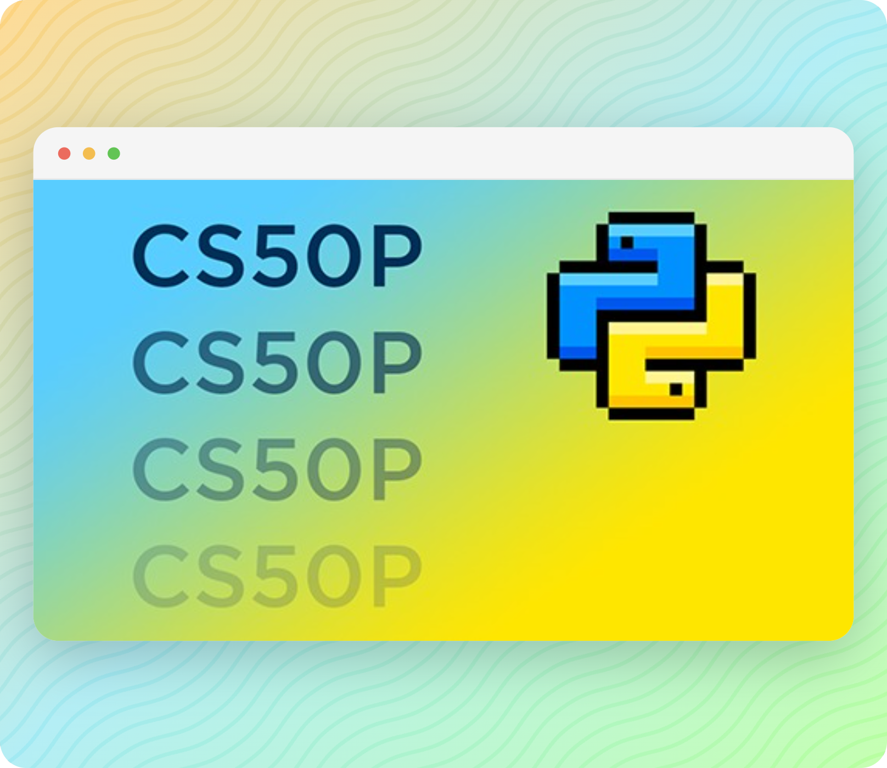
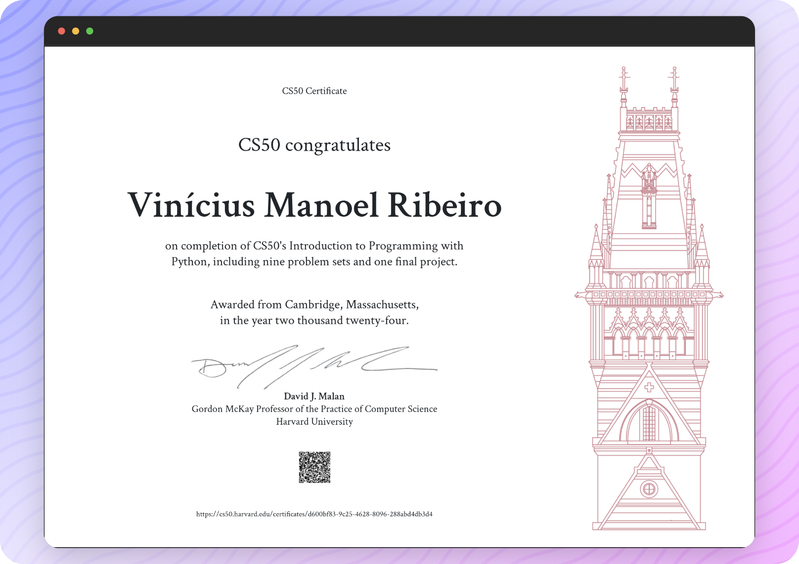

# Harvard CS50P 2022 Solutions 

An introduction to programming using a language called Python. Learn how to read and write code as well as how to test and “debug” it. Designed for students with or without prior programming experience who’d like to learn Python specifically. Learn about functions, arguments, and return values (oh my!); variables and types; conditionals and Boolean expressions; and loops. Learn how to handle exceptions, find and fix bugs, and write unit tests; use third-party libraries; validate and extract data with regular expressions; model real-world entities with classes, objects, methods, and properties; and read and write files. Hands-on opportunities for lots of practice. Exercises inspired by real-world programming problems. No software required except for a web browser, or you can write code on your own PC or Mac.

## Screenshots 🖼️

## Week 0 - Functions, Variables 🧩

Functions. Arguments. Side Effects. Bugs. Return Values. Variables. Comments. Pseudocode. str. Parameters. int. Operators. Interactive Mode. float. def. Scope. return.

- [Einstein](./week_0/einstein/einstein.py)
- [Faces](./week_0/faces/faces.py)
- [Indoor](./week_0/indoor/indoor.py)
- [Playback](./week_0/playback/playback.py)
- [Tip](./week_0/tip/tip.py)

## Week 1 - Conditionals 🚥

if. elif. else. or. and. bool. match.

- [Bank](./week_1/bank/bank.py)
- [Deep](./week_1/deep/deep.py)
- [Extensions](./week_1/extensions/extensions.py)
- [Interpreter](./week_1/interpreter/interpreter.py)
- [Meal](./week_1/meal/meal.py)

## Week 2 - Loops ➿

while. for. list. range. continue. break. list. len. dict. None.

- [Camel](./week_2/camel/camel.py)
- [Coke](./week_2/coke/coke.py)
- [Caesar](./week_2/nutrition/nutrition.py)
- [Nutrition](./week_2/plates/plates.py)
- [Twttr](./week_2/twttr/twttr.py)

## Week 3 - Exceptions ⛔

SyntaxError. ValueError. try. except. NameError. else. pass. raise.

- [Fuel](./week_3/fuel/fuel.py)
- [Grocery](./week_3/grocery/grocery.py)
- [Outdated](./week_3/outdated/outdated.py)
- [Taqueria](./week_3/taqueria/taqueria.py)

## Week 4 - Libraries 📖

Modules. random. import. from. statistics. Command-Line Arguments. sys. sys.argv. IndexError. sys.exit. Slices. Packages. PyPI. pip. cowsay. APIs. requests. JSON. __name__.

- [Adieu](./week_4/adieu/adieu.py)
- [Bitcoin](./week_4/bitcoin/bitcoin.py)
- [Emojize](./week_4/emojize/emojize.py)
- [Figlet](./week_4/figlet/figlet.py)
- [Game](./week_4/game/game.py)
- [Professor](./week_4/professor/professor.py)

## Week 5 - Unit Tests 🧨

assert. AssertionError. pytest. Packages. __init__.py.

- [Bank](./week_5/bank/bank.py) → [Tests](./week_5/bank/test_bank.py)
- [Fuel](./week_5/fuel/fuel.py) → [Tests](./week_5/fuel/test_fuel.py)
- [Plates](./week_5/plates/plates.py) → [Tests](./week_5/plates/test_plates.py)
- [Twttr](./week_5/twttr/twttr.py) → [Tests](./week_5/twttr/_testtwttr.py)

## Week 6 - File I/O 📂

list. open. with. sorted. CSV. dict. csv. PIL.

- [Lines](./week_6/lines/lines.py)
- [Pizza](./week_6/pizza/pizza.py)
- [Scourgify](./week_6/scourgify/scourgify.py)
- [Shirt](./week_6/shirt/shirt.py)

## Week 7 - Regular Expressions 🎭

Regular Expressions. Regexes. re. re.search. re.match. re.fullmatch. re.sub. re.split. re.findall.

- [Numb3rs](./week_7/numb3rs/numb3rs.py) → [Tests](./week_7/numb3rs/test_numb3rs.py)
- [Response](./week_7/response/response.py)
- [Um](./week_7/um/um.py) → [Tests](./week_7/um/test_um.py)
- [Watch](./week_7/watch/watch.py)
- [Working](./week_7/working/working.py) → [Tests](./week_7/working/test_working.py)

## Week 8 - Object-Oriented Programming 💻

tuple. Classes. class. Objects. Attributes. Instance Variables. Methods. Instance Methods. __init__. raise. __str__. Properties. @property. Decorators. int. str. str.lower. str.strip. list. list.append. dict. Class Methods. @classmethod. Static Methods. @staticmethod. Inheritance. BaseException. Operator Overloading. object.__add__.

- [Jar](./week_8/jar/jar.py) → [Tests](./week_8/jar/test_jar.py)
- [Seasons](./week_8/seasons/seasons.py)→ [Tests](./week_8/seasons/test_seasons.py)
- [Shirtificate](./week_8/shirtificate/shirtificate.py)

## Week 9 - Et Cetera ♾️

docs.python.org. set. global. Constants. Type Hints. mypy. Docstrings. peps.python.org. argparse. Unpacking. *args. **kwargs. print. map. List Comprehensions. filter. Dictionary Comprehensions. enumerate. Generators. yield. Iterators.

## Final Project 📃

Once you have solved each of the course’s problem sets, it’s time to implement your final project, a Python program of your very own! The design and implementation of your project is entirely up to you, albeit subject to these requirements:

- Your project must be implemented in Python.
- Your project must have a main function and three or more additional functions. At least three of those additional functions must be accompanied by tests that can be executed with pytest.
    - Your main function must be in a file called project.py, which should be in the “root” (i.e., top-level folder) of your project.
    - Your 3 required custom functions other than main must also be in project.py and defined at the same indentation level as main (i.e., not nested under any classes or functions).
    - Your test functions must be in a file called test_project.py, which should also be in the “root” of your project. Be sure they have the same name as your custom functions, prepended with test_ (test_custom_function, for example, where custom_function is a function you’ve implemented in project.py).
    - You are welcome to implement additional classes and functions as you see fit beyond the minimum requirement.
- Implementing your project should entail more time and effort than is required by each of the course’s problem sets.
- Any pip-installable libraries that your project requires must be listed, one per line, in a file called requirements.txt in the root of your project.

[Project](./project/)

## CS50 Certificate 📑

## License 📝

A short and simple permissive license with conditions only requiring preservation of copyright and license notices. Licensed works, modifications, and larger works may be distributed under different terms and without source code.

